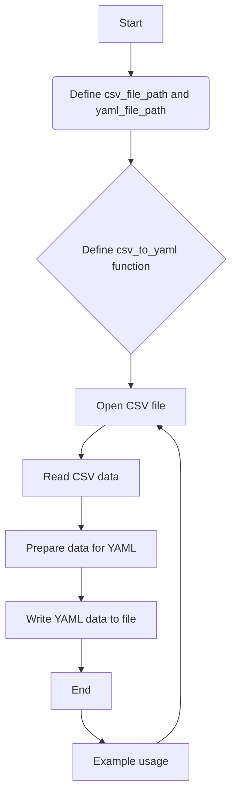

# csv2yml converter

> [!note] 
> CSV2YML converter is meant to be a script that is for a very specific use case. In this case we feed python a table `.csv` file and itll spit out 5 fields auto filled with their respective information.  Below is a diagram describing how this works.

